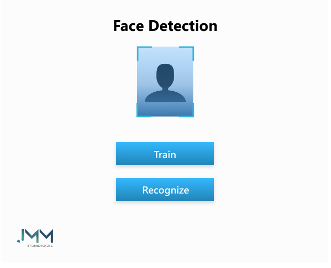
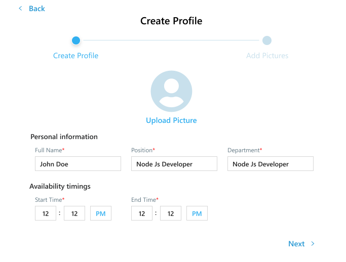
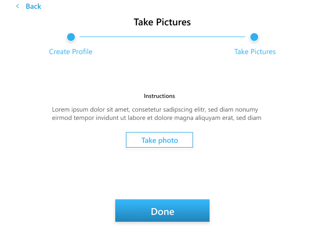
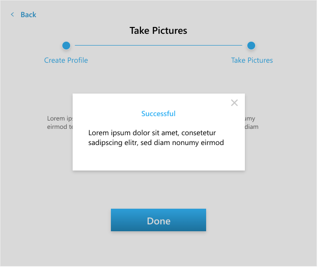

# Face-IO

INTRODUCTION

Face IO is smart attendance system that includes facial identification. It is time saving and eradicates the possibilities of proxy attendance due to the facial authorization. Open-CV, and CNN trained neural network model is serving the purpose for this smart attendance system.

KEY FEATURES:

1. Face identification in real time by the trained model.
2. Achieving maximum efficiency by removing the distortions due to light changes in the room and other disturbances.
3. Real time attendance sorting in the database.

TECHNOLOGIES & TOOLS USED

1. Deep Learning
2. Machine Learning
3. OpenCV
4. SQL Database
5. Python

SCREENSHOTS

     
